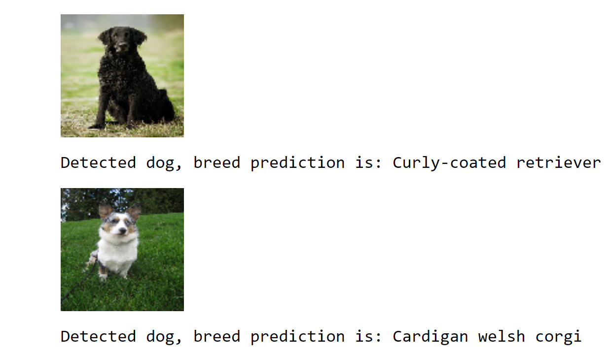
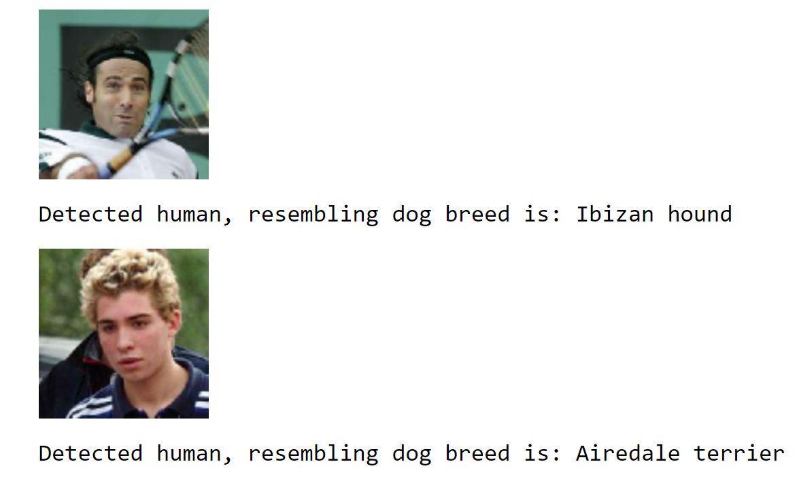

# Project Overview

This project implements dog-breed classifier using CNN on pytorch as part of my learning journey in the Udacity deep-learning nanodegree program. It will first detect if the image specified is a dog or human then find the most resembling dog breed.

The implementation contains from-scratch model and transfer learning using pretrained VGG16.

## Sample Output

### Dog Detection

### Human Detection

